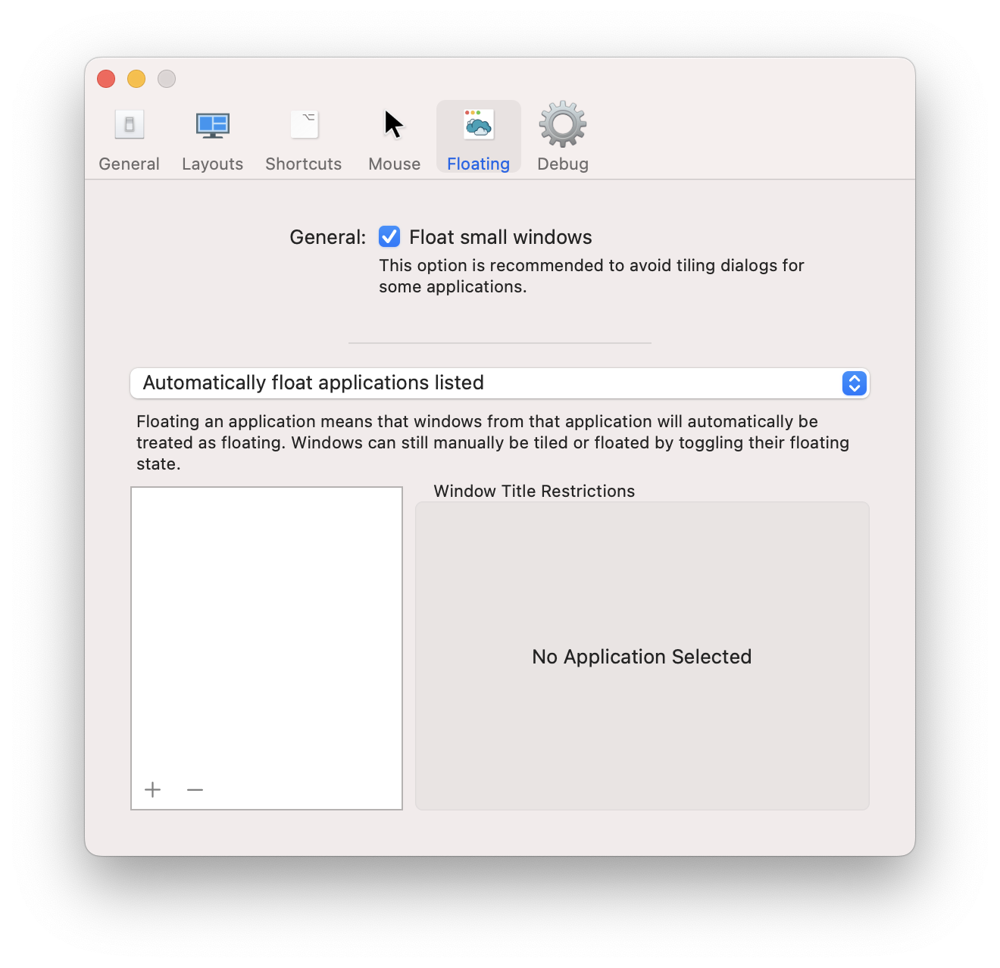
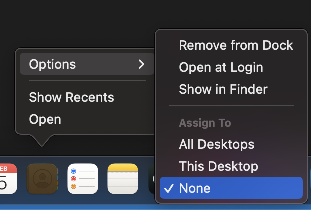

# Troubleshooting

## Nothing is working!

Here are some common problems and their solutions.

### "Always float"

Amethyst has the option to float everything by default until the user manually intervenes. When this mode is unintentionally enabled it can appear that nothing is working. The option is located in settings in the Floating tab and configured with the `floating-is-blacklist` key in a configuration file.

If you have not intentionally enabled this make sure that the option in the Floating tab says "Automatically float applications listed" as in this screenshot.



## One application isn't working!

### "Assign To All Desktops"

macOS has the option to assign an application specifically to no Desktops, one Desktop, or all Desktops. Amethyst does not handle the last option very well.

To change this setting you can right click (or control click or whatever gesture you may have associated with right click) on the application icon in the Dock. Under Options there is an Assign To section. See the screenshot below for reference.



## Amethyst won't open after download!

### "Apple could not verify Amethyst is free of malware"

Releases of this fork are signed but not notarized, so Gatekeeper blocks the first launch. Either right-click `Amethyst.app` and choose **Open**, or open System Settings → Privacy & Security, scroll to the Security section, and click **Open Anyway**. This is needed once per fresh download; in-app updates are not affected.

### "Amethyst is damaged and can't be opened"

Some browsers and archive tools leave a quarantine flag that Gatekeeper treats as damage. Clear it and launch again:

```bash
xattr -d com.apple.quarantine /Applications/Amethyst.app
```

## Updates aren't working!

### "Check for Updates…" finds nothing, or offers the upstream Amethyst

Builds of this fork older than v0.24.4 point at the upstream update feed. Download the [latest release](https://github.com/mgabs/Amethyst/releases/latest) and replace `Amethyst.app` by hand once; later updates arrive in-app.

### Accessibility permission is lost after an update

macOS ties the permission to the app's code signature. Official releases are signed with a stable certificate, so this should not happen. It does happen with self-built or ad-hoc-signed copies: re-grant the permission under System Settings → Privacy & Security → Accessibility. If a stale duplicate entry lingers, clear it first:

```bash
tccutil reset Accessibility com.amethyst.Amethyst
```

Do not keep a signed copy and an unsigned copy around at the same time. They share the bundle identifier but not the signing identity, so granting permission to one revokes it for the other, and an ad-hoc build changes identity on every rebuild. The fastlane `debug` and `local` lanes, and any `xcodebuild` call with `CODE_SIGNING_ALLOWED=NO`, produce unsigned copies; a plain Run from Xcode signs with the project's certificate and is safe to use alongside the installed app.
